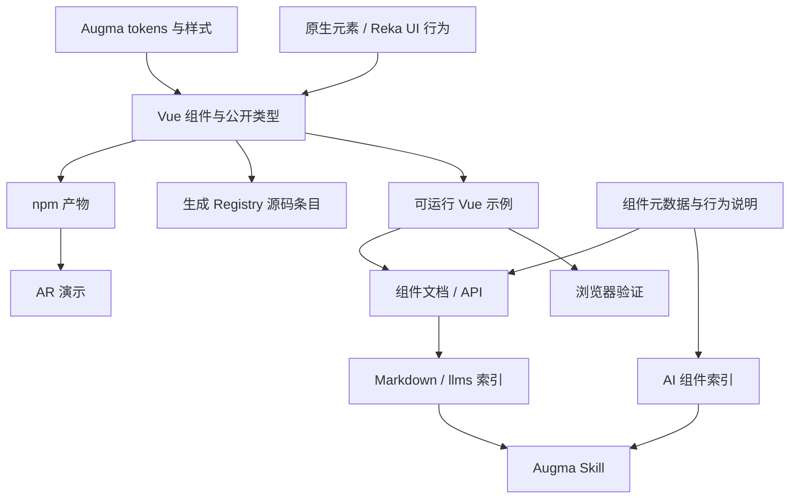

# Augma 组件体系与展示站重构计划

日期：2026-09-22。状态：用户已确认并授权实施；代码已按本计划重构，公网发布与实机 AR 验收单独跟进。视觉参考《刀剑神域：序列之争》的 Augma 设备 UI。

目标：让开发者与 AI 编程助手能发现、安装、定制并正确使用 Augma 的 SAO / AR 风格组件；统一展示与文档入口，并保留独立加载的 AR 演示。

## 1. 已确认的范围

| 决策 | 结论 |
| --- | --- |
| 产品重心 | 组件体系与展示站优先，AR Client 作为演示入口 |
| AI 目标 | 面向 Codex、Claude 等编程助手，交付 Skill、机器可读文档、组件元数据 |
| 兼容策略 | 可以从零重构，不要求兼容旧 API 或旧包结构 |
| 技术栈 | 框架无关的 tokens / 样式基础，首版完整交互支持 Vue 3 |
| 使用方式 | npm 包 + 核心组件源码 Registry，两者由同一份组件源文件生成 |
| 组件范围 | 基础交互组件 + Augma Panel / HUD，优先完整可用 |
| 站点组织 | 一个主站，中文文档优先；代码与 AI Skill 使用英文 |
| 新站域名 | `augma.yunyoujun.cn` 为主域，`augma.yyj.moe` 由 Cloudflare Pages 托管同一站点 |
| 展示深度 | 实时预览、源码复制、API、主题切换和预设状态示例 |
| 行为实现 | 优先复用 Reka UI 等成熟无样式组件 |
| 依赖政策 | 稳定版本优先；VitePress 2.x 另列升级阶段 |

首版边界：站内模型调用、聊天服务、A2UI、React 适配、任意代码编辑器、Props 调节器、WebXR 新功能以及完整英文文档均放入后续候选范围。

## 2. 现状与参考结论

Augma 审查基线为 `6cc8235841a52383ddb9507d4be12fd4f2aa05fb`。计划阶段完成了静态源码、公开文档与 npm 元数据核查；下面为实施前的历史审查结论。实施阶段另行进行了安装、构建和自动化验证；设备上的 AR 功能仍需实机验收。

| 已核查事实 | 对重构的影响 |
| --- | --- |
| 已有 VitePress 文档站，支持 Vue demo、源码展开与 frontmatter API 表 | 复用内容与示例思路，重做统一数据来源和展示体验 |
| 14 个组件文档条目，包含 10 个自有 SFC，以及基础样式和第三方封装 | 文档条目数量不等于稳定组件数量，按本计划重新定义公开组件 |
| README 使用 `app.use(augma)`，库默认导出实际是版本字符串；样式入口也需核验 | 以真实安装产物的消费测试作为发布门槛 |
| 文档与客户端通过源码 alias 使用组件 | 仅让仓库内部构建成功不足以证明 npm 包可用 |
| CI 使用 Node 14 / 16 / 18，唯一测试为 `1 + 1 = 2` | 工具链升级必须覆盖 CI、类型检查、组件交互和包消费 |
| 文档部署步骤被注释，发布脚本扫描 `packages.json` 且路径有误 | 重建站点部署与发布流程，不沿用旧脚本假设 |
| AR 页面包含实验代码，目标检测挂载被注释，没有 LLM 服务 | 将 AR 作为独立演示迁移；AI 编程接入从文档与组件契约建立 |

证据：[当前安装说明](https://github.com/YunYouJun/augma/blob/6cc8235841a52383ddb9507d4be12fd4f2aa05fb/README.md)、[库入口](https://github.com/YunYouJun/augma/blob/6cc8235841a52383ddb9507d4be12fd4f2aa05fb/packages/augma/src/index.ts)、[展示组件](https://github.com/YunYouJun/augma/blob/6cc8235841a52383ddb9507d4be12fd4f2aa05fb/packages/.vitepress/theme/components/demo/DemoBlock.vue)、[CI](https://github.com/YunYouJun/augma/blob/6cc8235841a52383ddb9507d4be12fd4f2aa05fb/.github/workflows/ci.yml)、[发布脚本](https://github.com/YunYouJun/augma/blob/6cc8235841a52383ddb9507d4be12fd4f2aa05fb/scripts/release.ts)。这些路径描述重构前的状态，实施后可能迁移。

参考 ak-ui 的固定版本为 `93a5008a122b29de078682d4f20b09bf235500e6`。借鉴其设计基础、示例单一来源、Vue Registry、Agent Skill 和消费侧验证方式。Augma 保留自己的视觉语言。

ak-ui 的 A2UI 是本地模拟实验；仓库未发现 `llms.txt` 及对应生成逻辑。下面的机器可读索引是 Augma 的新增设计。[ak-ui 源码](https://github.com/YunYouJun/ak-ui/tree/93a5008a122b29de078682d4f20b09bf235500e6)、[A2UI 边界](https://ak-ui.yyj.moe/guide/a2ui)。

## 3. 目标结构与公开边界

以下为工程组织提案；包名与发布权限在 P0 核查。新站以 `augma.yunyoujun.cn` 为主域，`augma.yyj.moe` 由 Cloudflare Pages 托管同一站点，DNS、证书与托管配置在 P6 核查。

```text
apps/
  site/                 # VitePress 统一主站：展示与文档采用各自布局，预留英文内容结构
  ar/                   # 独立构建的 AR 演示，部署到 /ar/
packages/
  core/                 # 拟发布 @augma/core：tokens 与组件基础样式
  augma/                # 发布 augma：Vue 组件、类型、明确的公共出口
examples/
  components/           # Vue 示例：预览、源码展示、测试共同使用
  compositions/         # HUD / 控制面板等组合示例
registry/               # Registry 清单；生成内容来自正式组件源码
skills/augma/           # 英文 SKILL.md 与按需阅读的参考文档
scripts/                # 元数据、Registry、文档索引、包验证、发布工具
tests/
  components/           # 行为与可访问性相关测试
  browser/              # 展示站与演示入口冒烟测试
  consumers/            # npm、CSS-only、SSR、Registry 消费项目
```

数据关系：



公开边界：

- Core 提供 `tokens.css` 与 `style.css`，使用 `--agm-*`、`.agm-*` 命名空间；tokens-only 入口不重置页面全局元素，不要求安装 Vue。
- Vue 层使用 Vue 3、TypeScript、Composition API 与 `<script setup>`。基础按钮和输入优先使用原生语义；Select、Dialog 等使用 Reka UI 行为，样式统一归 Core。
- `augma` 提供具名组件、`.d.ts` 和按需导入出口；是否保留全局注册仅作为实现细节，文档以具名导入为标准路径。
- Reka UI 的选择依据是其无样式结构、键盘和焦点管理能力，仍须验证 Augma 包装后的行为。[官方介绍](https://reka-ui.com/docs/overview/introduction)
- Vue 包不引入 Babylon、摄像头、目标检测或站点代码。AR 专用逻辑留在演示应用内，出现真实复用需求后再单列 Hooks 包。
- npm 与 Registry 共用源文件。Registry 生成器负责相对依赖和辅助文件的完整输出；复制后的组件依赖 Core 样式及必要的 Reka UI 包，不反向调用 npm 版本的同名 Vue 组件。
- UnoCSS 可用于站点布局，组件使用者不需要配置 UnoCSS 或 Tailwind 才能获得正确样式。

## 4. 首版组件与站点体验

| 组件组 | 首版条目 | 必须覆盖的行为 |
| --- | --- | --- |
| 基础输入 | Button、IconButton、Input | 焦点、禁用、加载、标签、输入与错误提示 |
| 选择与数值 | Select、Switch、Slider | 键盘控制、受控状态、v-model、禁用与边界值 |
| 浮层与反馈 | Dialog、Tooltip、Toast | 打开关闭、焦点返回、Escape、可访问名称和通知语义 |
| Augma 特征 | Panel、HudStatus、HudProgress | 明暗主题、信息层级、语义状态、确定 / 不确定进度、减少动画 |

每个组件页面具备：用途、安装方式、实时示例、可复制完整源码、Props / Events / Slots、键盘行为、主题与状态示例、必要的使用边界。组合示例至少包含一个 HUD 状态面板和一个控制面板。

示例文件是预览、源码展示与浏览器测试的共同来源。API 类型与默认值以公开组件定义为依据；描述、分类、键盘约定和示例关联在类型化元数据中维护。站点 API 与 AI 索引由同一份契约生成，避免两套描述分开修改。

站点导航为：首页、快速开始、设计规范、组件、AI 接入、AR 演示。首页提供真实组件组成的视觉预览，以及「浏览组件」「让 AI 使用 Augma」「体验 AR」三个入口。文档页优先保证阅读和操作效率。

补充组织建议：首版将展示与文档放在同一个站点工程中，按内容用途使用不同布局。用户可从组合展示直接进入对应组件的示例与 API；导航、搜索、主题、版本和示例数据共同维护。VitePress 支持自定义页面布局，可将全宽展示页与带侧栏的文档页放在同一站点内。[页面布局文档](https://vitepress.dev/reference/frontmatter-config#layout)

| 路径 | 内容与布局 |
| --- | --- |
| `/` | 品牌首页，展示 Augma 的视觉与交互特点 |
| `/showcase/` | HUD、控制面板等组合展示，全宽布局，链接到所用组件文档 |
| `/guide/`、`/design/` | 快速开始、接入与设计规范，文档布局 |
| `/components/` | 组件目录，以及预览、源码、API 合一的组件页面 |
| `/ai/` | Skill 安装、AI 使用指南和组件索引说明 |
| `/ar/` | 独立构建的 AR 演示，保留返回主站入口 |
| `/r/`、`/llms.txt` | Registry 与机器可读入口 |

如果未来展示部分发展为有账号、后端或独立发布周期的产品，再拆分应用；现阶段两个独立文档 / 展示站会增加同步示例、版本、搜索和部署的维护工作。AR 因浏览器能力与较重依赖保持独立构建，并在部署时与主站产物一起组合。

设计规范覆盖颜色语义、透明面板、边框与几何、字体与数字、层级、状态和动效。提供浅色 / 深色主题、主题持久化与 `prefers-reduced-motion`。保留 Augma 风格，具体视觉数值在 P1 的 token 样板中确定。

浏览器验收覆盖 Chromium、Firefox、WebKit 的普通站点功能，以及桌面和窄屏布局。摄像头和 WebXR 根据能力检测显示独立状态，设备支持范围在 AR 文档中明确。

## 5. AI 编程接入与 Registry

| 交付物 | 内容 | 验收方式 |
| --- | --- | --- |
| `skills/augma/SKILL.md` | 集成、选组件、组合界面、主题定制、审查流程；按需链接组件与设计规范 | 验证公开安装方式，Skill 路径和参考链接可达 |
| `llms.txt` | 精简入口、版本、安装、规范、组件目录和示例链接 | 生成并检查链接、版本和索引完整性 |
| `llms-full.txt` / Markdown 页面 | 文档的纯文本内容及版本信息 | 从文档构建生成，避免重复手写 |
| `components.json` | 带 schemaVersion 的组件清单、导入、API、状态、示例、Registry URL | 校验 schema、公开导出和示例路径一致 |
| `/r/*.json` | 首批 Button、Input、Panel、Dialog、HudStatus、HudProgress | 用固定版本 shadcn-vue CLI 安装到干净 Vue 项目，再做类型检查与构建 |
| AI 验收案例 | 控制面板、HUD、主题调整三类固定任务 | 检查是否使用真实 API、能构建，以及设计和键盘行为是否符合规范 |

Registry 采用 shadcn-vue 的公开格式，清楚区分 npm 依赖与 Registry 内部依赖；样式版本与组件版本一起发布。[Registry 格式](https://www.shadcn-vue.com/docs/registry/registry-item-json)

AI 验收不以某次模型回答作为唯一判断。生成产物仍须通过消费项目构建和确定的行为检查；未具备实际助手测试环境时，明确标记该项未验证。首版不新增模型账单、API Key 设置或服务端模型代理。

## 6. 依赖与工具链策略

先修复可重复安装与基础命令，再按层升级，锁定通过验证的组合。以下版本来自 2026-09-22 查询，属于候选基线，不代表已完成兼容性验证。

| 范围 | 当前声明 | 计划 |
| --- | --- | --- |
| Node | CI 14 / 16 / 18，没有统一引擎声明 | 统一 Node 24 LTS，本地、CI、发布一致 |
| pnpm | 10.8.0 | 评估稳定版 12.5.1 的迁移，固定 packageManager 与 lockfile |
| Vue | ^3.5.13 | 3.5.43，统一公共 peer 范围与实际测试范围 |
| Vite / plugin-vue | 6.2.5 / 5.2.3 | 库与 AR 应用评估 Vite 8.3.0 / plugin-vue 6.0.9 |
| VitePress | 1.6.3 | 稳定版 1.6.4，移到独立站点 workspace |
| TypeScript / vue-tsc | 5.8.3 / 2.2.8 | 先验证 5.9.3 / 3.3.11；TS 最新稳定版 7.0.2 单独做兼容性验证，不作为首版阻塞条件 |
| Vitest | 3.1.1 | 评估 5.0.1；增加必要的组件行为与浏览器验证 |
| VueUse | 13.1.0，库 peer 仍 4.4.1 | 按实际使用更新；15.0.0 是候选，移除过时 peer 声明 |
| UnoCSS | 66.1.0 beta | 使用稳定版 66.10.5，限制在需要它的 workspace |
| Babylon | 8.1.1 | 仅 AR 阶段评估 9.27.1，不影响主站首屏及 Core |
| 旧集成 | v-tooltip、vue-toastification 预发布版本，tfjs-yolo 等 | 随对应实现迁移后删除；保留任何依赖都须有实际用途 |

VitePress 1.6.4 自身依赖 Vite 5.x。接受文档与库工具链暂时并存，在 workspace 内隔离其配置和依赖；不通过全局 override 强迫其使用 Vite 8。若验证发现当前稳定版的明确阻塞问题，再提交单独技术决策，保持用户确认的稳定版政策。

取消依赖全局 hoist 掩盖缺失声明的做法：各 workspace 声明直接依赖，先解决 peer 冲突，再启用严格检查。将安装期间写元数据的 `preinstall` 改为显式生成命令，CI 使用冻结 lockfile 的安装。

依据：[Node 发布状态](https://nodejs.org/en/about/previous-releases)、[Vite 环境要求](https://vite.dev/guide/)、[VitePress 稳定包元数据](https://registry.npmjs.org/vitepress/1.6.4)。其余候选版本通过官方 npm registry 的 `/<package>/latest` 查询，实施时重新核查并记录实际选定版本。

## 7. 分阶段实施与退出条件

| 阶段 | 主要工作 | 完成标准 |
| --- | --- | --- |
| P0 工程基线 | 记录现有可运行程度；确认 npm 命名权限；整理 workspace；统一 Node / pnpm；修复显式依赖和生成命令；升级基础工具；用 Button / Dialog 试验类型与打包链路 | 干净环境可冻结安装；lint、typecheck、基础包构建和空站点构建可重复执行；明确锁定的版本组合 |
| P1 设计基础 | 建立 Core tokens、主题、公共 CSS 出口；完成 Button、Input、Panel 样板及一张 HUD 组合稿 | CSS-only 消费项目可用；无 Vue 依赖；token-only 不污染全局；明暗主题和减少动画生效 |
| P2 Vue 组件 | 完成首版组件，复用 Reka UI 行为；整理类型、受控状态、导出；生成组件契约；替换旧组件的对应用途 | 首版组件清单全部具备示例、API 与必要行为验证；SSR 导入不触碰浏览器对象 |
| P3 展示主站 | 在 apps/site 搭建统一主页、展示布局、文档布局与导航；实现示例预览、源码复制、API、主题状态、搜索和移动布局；整理中文指南 | 展示可直达对应组件文档；所有公开组件可检索；示例正常渲染；源码可直接使用；无内部断链和页面运行错误 |
| P4 Registry 与 AI | 从正式源码生成首批 Registry；交付英文 Skill、Markdown / llms 索引、JSON 元数据和三类 AI 验收任务 | Registry 干净安装与构建通过；索引与包版本一致；Skill 引用真实组件；明确记录 AI 产物验收结果 |
| P5 AR 迁移 | 将现有 Client 的展示用途迁移到新组件；独立构建到 /ar/；处理摄像头、XR、生命周期和按需加载 | 普通站点无需 AR 能力；无权限 / 无设备时有可理解状态；离开页面停止摄像头和渲染循环；支持设备上完成单独验收 |
| P6 发布准备 | 完成包消费、浏览器验证、构建产物检查；替换发布脚本；统一静态部署；配置主域与别名域跳转；编写旧版到新版变更说明与发布清单 | 同一提交通过 CI；npm tarball 与 Registry 可在独立项目使用；站点预览、/ar/ 子路径与旧入口跳转通过验证；别名域永久跳转保留路径与查询参数且无循环；公开链接统一到主域；发布配置和产物可供审阅 |

依赖顺序为 P0 → P1 → P2。P3 在 P1 样板确定后即可推进；P4 依赖稳定的组件契约与文档地址；P5 依赖新组件及站点路径；P6 汇总全部首版验收。

按阶段拆分提交与 PR。每个 PR 应保持自身可验证；提交标题使用 Conventional Commits，例如 `build(workspace): establish reproducible toolchain`、`feat(core): add augma design tokens`、`feat(registry): generate vue component entries`。

## 8. 验收与发布约定

首版完成须同时满足：

1. 干净检出后安装、lint、类型检查、组件测试、包构建和文档构建通过。
2. 从真实打包产物安装到独立 Vue 项目，具名导入、样式、类型与 SSR 导入成立；CSS-only 项目不被要求安装 Vue。
3. 首批 Registry 通过真实 CLI 安装，包含完整文件与依赖，能构建并展现正确样式。
4. 每个公开组件都有实际示例，覆盖其有意义的状态；Dialog / Select / Slider 等完成键盘与焦点路径验证。
5. 主站通过三个浏览器的功能冒烟，以及桌面、窄屏布局与减少动画检查。仅对稳定的代表页面建立少量视觉基线，组件截图可作为人工审阅报告。
6. AI 文档索引、组件元数据、Registry 和 npm 版本一致，链接与公开 API 可校验。
7. AR 的依赖按需加载，用户主动开启摄像头；能力不支持、权限拒绝和资源销毁均有可验证行为。
8. README 安装步骤从发布产物验证，公共入口不依赖仓库别名；旧版变更说明明确不兼容的接口和旧功能去向。

新站域名最初规划为 `https://augma.yunyoujun.cn` 主域与 `https://augma.yyj.moe` 跳转入口。2026-09-24 的部署要求改为在 Cloudflare Pages 上为 `augma.yyj.moe` 直接提供相同站点；以 `docs/release.md` 中的现行配置为准。

- `augma.yyj.moe` 由 Cloudflare Pages 提供与主域相同的页面。例如 `https://augma.yyj.moe/components/button?theme=dark` 直接返回组件页。
- 发布链接、canonical、sitemap、Skill、机器可读文档和 Registry 地址统一使用 `https://augma.yunyoujun.cn`。
- 展示与文档合并于主站，采用各自布局；两个域名不承担不同内容分区。
- P6 检查两个域名的 DNS、证书和托管能力；根据旧站的实际可控性，为 `docs.augma.elpsy.cn` 与 `augma.elpsy.cn` 制定逐路径迁移映射，其中旧 Client 入口指向新站 `/ar/`。

公开发布建议以新的 0.x 版本承载这次不兼容重构，具体版本在 release PR 固定。Core 先于 Vue 包发布，Registry 固定兼容的 Core 版本。优先使用 npm OIDC，并验证仓库、工作流和包权限；流水线必须发布已通过检查的同一份产物。实际发布和域名切换属于后续执行步骤，本计划不触发它们。

主要风险及处理：双重分发通过同源生成与消费测试控制；旧工具链与新工具链通过 workspace 隔离；AR 设备差异通过独立入口和实机记录处理；AI 文档漂移通过统一组件契约与生成校验控制。

## 9. 后续候选阶段

首版验收后再评估 VitePress 2 稳定版、TypeScript 最新稳定版迁移、更多 Registry 组件、英文文档、属性调节器、在线编辑器，以及新的 WebXR 功能。

如果未来要做站内 AI 或运行时生成界面，另行确定模型提供方、部署与费用、会话数据、组件协议和操作回传；届时再选择 A2UI 或其他方案。

实施记录：统一主站、12 个 Vue 组件、独立 CSS Core、6 个 Registry 条目、英文 Skill、机器可读索引与独立 AR 入口已实现。发布流程、域名跳转和未执行的外部步骤见 [发布说明](../release.md)。
